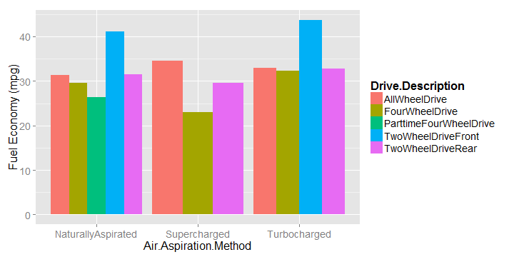

### Ever wonder why some cars get better fuel economy?
---------
- MPG Explorer let's you quickly visualize and analyze which features influence fuel economy.
- Just choose the variables you wish to explore using the dropdown menus, and MPG Explorer will automatically plot their influence on fuel economy and run a linear regression model!

<div style='text-align: center;'>
    
</div>


--- 

### The visualization varies depending on the input
---------
- To help aid in visualization, MPG Explorer automatically adapts its output depending on the choice of features.
- For example, if you choose two categorical variables, MPG Explorer displays a bar plot with the average fuel economy as a function the chosen features.



---

### The visualization varies depending on the input
---------
If you choose at least one continuous variable, you will get a scatterplot 


---

### Quantifying how different features inflence fuel economy
---------
MPG Explorer automatically quantifies the relationship between your chosen features and fuel economy using linear regression.

```
## 
## Call:
## lm(formula = as.formula(paste("Fuel.Economy ~", input$var1, "*", 
##     input$var2)), data = data)
## 
## Residuals:
##    Min     1Q Median     3Q    Max 
## -13.72  -3.14  -0.39   2.48  24.63 
## 
## Coefficients:
##                                     Estimate Std. Error t value Pr(>|t|)
## (Intercept)                          56.2034     1.3979   40.21  < 2e-16
## Engine.Displacement                  -5.8583     0.4041  -14.50  < 2e-16
## Number.of.Gears                      -1.1178     0.2625   -4.26  2.2e-05
## Engine.Displacement:Number.of.Gears   0.2618     0.0731    3.58  0.00036
##                                        
## (Intercept)                         ***
## Engine.Displacement                 ***
## Number.of.Gears                     ***
## Engine.Displacement:Number.of.Gears ***
## ---
## Signif. codes:  0 '***' 0.001 '**' 0.01 '*' 0.05 '.' 0.1 ' ' 1
## 
## Residual standard error: 4.59 on 1103 degrees of freedom
## Multiple R-squared:  0.626,	Adjusted R-squared:  0.625 
## F-statistic:  616 on 3 and 1103 DF,  p-value: <2e-16
```


